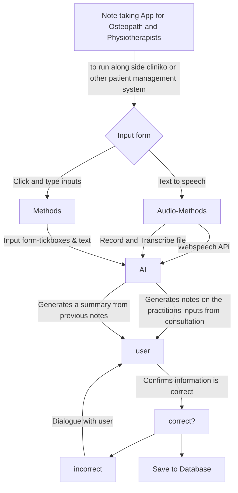

# capstone-project
Capstone Project for completing Institute of Data and AUT Professional certification in software engineering

##  Background & Objectives
###  Background
I am an osteopath and part of being an osteopath is documenting our consultations with patients. Our software is good but I can't make treatment note templates how I want. Additionally there are no plugins that I can use to directly send exercise programs to patients for their rehab.

###  Objectives

###  Needs
- I aim to create an easy to use application where Osteopath and Physiotherapists can easily document their consultations with less typing. I'm thinking a tick the boxes, speech to text, possible ai integration/autocomplete

###  Nice to haves
- Different themes so you can tailor the program to your business asthetic
- Calendar
- Booking system
- reminders when notes haven't been finalized
- staff messaging system
- take payments
- mobile app for patients so they can log in, track their symptoms and progress goals, have their prescribed exercises and goals
  
##  Assumptions
- anyone using this software has internet connection

##  User Stories and Requirements

##  Open Questions/out of scope
-ACC billing integration

## H2 Designs, mockups, Flow Charts etc

## H2 Tasks</h2>
## H2 Results and conclusions
