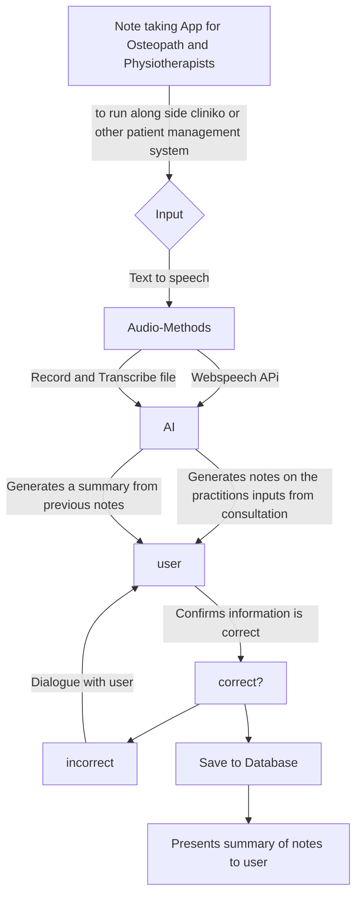

# capstone-project
Capstone Project for completing Institute of Data and AUT Professional certification in software engineering

##  Background & Objectives
###  Background
I am an osteopath and part of being an osteopath is documenting our consultations with patients. Our software is good but I can't make treatment note templates how I want. Additionally there are no plugins that I can use to directly send exercise programs to patients for their rehab within the app.

###  Objectives
- I aim to create an easy to use application where Osteopath and Physiotherapists can easily document their consultations with less typing. I'm thinking a tick the boxes, speech to text, ai integration to help the practitioner

###  Needs
-speech to text input
-ai conversational style back and forth
-ability to generate exercise program
-ability to generate letters to the specialist

###  Nice to haves
- secure login
- visual list of patients to
- Different themes so you can tailor the program to your business asthetic
- integration with cliniko
- reminders when notes haven't been finalized
- staff messaging system
- mobile app for patients so they can log in, track their symptoms and progress goals, have their prescribed exercises and goals
  
##  Assumptions
- anyone using this software has internet connection
- if this project was deployed with real patient data, It would have to abide by healthcare and privacy law

##  User Stories and Requirements

#Tech Stack
-NextJS
-Typescript
-React
-mongoDB

##  Open Questions/out of scope
- integration with cliniko
- reminders when notes haven't been finalized
- staff messaging system
- mobile app for patients so they can log in, track their symptoms and progress goals, have their prescribed exercises and goals
-ACC billing integration

## H2 Designs, mockups, Flow Charts etc`

## H2 Tasks
## H2 Results and conclusions

-barebones but functional application
